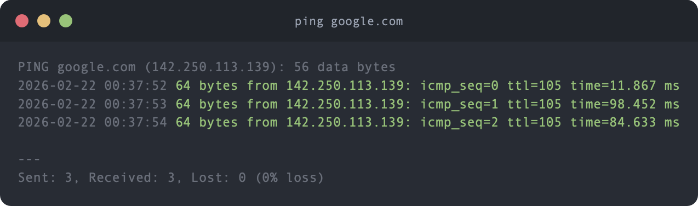

# ping — enhanced ping for macOS

A Swift CLI that wraps the system `ping`, adding timestamps to every response, color-coding successes and failures, and printing a clean packet loss summary on exit.



## Install

```sh
brew install ansilithic/tap/ping
```

Or build from source:

```sh
swift build -c release
cp .build/release/ping ~/.local/bin/
```

## Usage

```sh
ping google.com
ping 1.1.1.1 -c 5
```

All standard `ping` flags are passed through to the system binary.

## License

MIT
