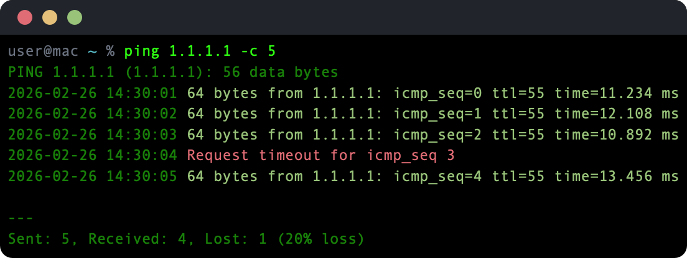

# ping


Enhanced ping for macOS — timestamps, color-coded output, and a clean packet loss summary.



## How it works

`ping` wraps the system `/sbin/ping`, adding a timestamp to every response line. Successful replies print in green, timeouts and errors in red, and diagnostic lines in dim gray. On exit (or Ctrl-C), a summary line reports sent, received, and lost packets with loss percentage — replacing the verbose system summary.

All standard ping flags pass through directly to the system binary.

## Install

```sh
brew install ansilithic/tap/ping
```

Or build from source (requires Xcode and macOS 14+):

```sh
make build && make install
```

## Usage

```
ping <target> [ping options]
```

All standard `/sbin/ping` flags work — `-c` (count), `-i` (interval), `-s` (packet size), etc.

### Examples

```sh
# Ping with timestamps and color
ping google.com

# Five packets then stop
ping 1.1.1.1 -c 5

# Fast ping with 0.2s interval
ping 10.0.1.1 -i 0.2
```

## License

MIT
